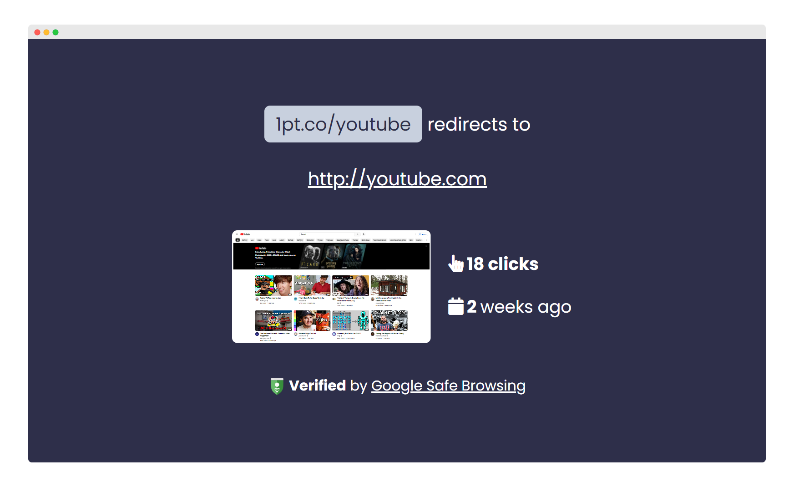

#   [1 Point URL Shortener](https://www.1pt.co)

[](https://1pt.co)

# Impact
**1pt** is a URL shortening service and hosts over **15,000+** redirects with **200,000+** visits

# 🛈 info.1pt.co
One of the biggest concerns that come with URL shortening is the fact that anyone can hide or mask their URL. Users can create shortened URLs that point to malicious or inappropriate sites, and the person receiving that URL won't realize it until they've clicked it and already been redirected to the harmful website. With this feature, however, anyone will be able to prepend info. to any 1pt.co URL to see the URL metadata before being redirected.

[](https://1pt.co)

Check out [1pt-co/info.1pt.co](https://github.com/1pt-co/info.1pt.co)

# Backend

The redirects are stored in a MySQL Database and the [API is written in PHP](https://github.com/1pt-co/api.1pt.co)

## 🖥️ API

The 1pt.co API is public so anyone can create a shortened URL

Endpoint: `https://csclub.uwaterloo.ca/~phthakka/1pt-express`

> Note: the old endpoint (`csclub.uwaterloo.ca/~phthakka/1pt`) is still live but will soon be **deprecated**.

### `/addURL`

**Method: `POST`**

| Parameter | Description | Example |
| --------- | ----------- | ------- |
| `long` | **Required** - The long URL to shorten | `https://www.param.me` |
| `short` | **Optional** - The part after `1pt.co/` that will redirect to your long URL. If this paramter is not provided or the requested short URL is already taken, it will return a random 5-letter string | `param` |

#### Example Response

```json
{
  "status": 201,
  "message": "Added!",
  "short": "param",
  "long": "https://www.param.me"
}
```

With this example [1pt.co/param](https://www.param.me) will redirect to `https://www.param.me`


-----
###### This project is maintained by [Param Thakkar](https://www.param.me)
